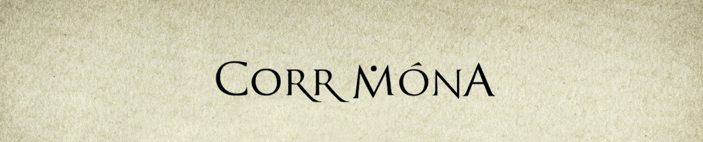

# **THE _CORR MHÓNA_ BAND WEBSITE**

## **Introduction**

This is the repository for the official **Corr Mhóna** website.

The **Deployed Version** of the site can be visited by clicking [**here**](https://an-slua-sidhe.github.io/milestone-1).

It was designed by me, **Paul Quinn**, to give the band a greater independent online presence. I initally designed and developed the site from the ground up as part of my [Fullstack Web Development Diploma](https://codeinstitute.net/courses) with the **Code Institute**, Ireland. The end goal is to provide a fully interactive website for the band, with e-commerce functionality.

The band already had an online presence through third party sites such as [Bandcamp](https://corrmona.bandcamp.com) and [Facebook](https://www.facebook.com/corrmhona). However, there was a desire to cut out the middle man and provide the band's fans with the means to quickly and easily access merchandise, information and gig announcements on a single platform. As a band member myself, I decided to undertake this task with the skills I had learned during the course.

A variety of features have been implemented already, and there are several more to come in the near future. I have used the band's own assets to populate the site and inspire its design. There is a full overview of the design/development process below, along with an extensive outline of the testing process, future features, user stories, responsivity and deployment.

## **Table of Contents**

1. [User Experience](#user-experience)
    - [User Stories](#user-stories)
        - [The Band Member](#the-band-member)
        - [The Music Fan](#the-music-fan)
        - [The Promoter](#the-promoter)
        - [The Journalist](#the-journalist)
        - [The Record Label](#the-record-label)
    - [Wireframes](#wireframes)
        - [Basic Wireframes](#basic-wireframes)
        - [Full Asset Mockups](#full-asset-mockups)
    - [Design Choices](#design-choices)
        - [Images](#images)
        - [Colours](#colours)
        - [Fonts](#fonts)
        - [Icons](#icons)
    - [Design Changes](#design-changes)
        - [General Changes](#general-changes)
        - [Mobile Changes](#mobile-changes)
        - [Tablet & Desktop Changes](#tablet-&-desktop-changes)

2. [Features](#features)
    - [Existing Features](#existing-features)
        - [Common Features](#common-features)
        - [Home](#home)
        - [Biography {'The Band'}](#biography)
        - [Discography](#discography)
        - [Contact](#contact)
    - [Future Features](#future-features)
        - [Contact Form](#contact-form)
        - [Shop](#shop)
        - [Flip Cards](#flip-cards)

3. [Technologies Used](#technologies-used)

4. [Testing](#testing)
    - [Developer Tools](#developer-tools)
        - [Chrome](#chrome)
        - [Firefox](#firefox)
        - [Internet Explorer](#internet-explorer)
    - [Media Queries](#media-queries)
        - [Mobile](#mobile)
        - [Tablet](#tablet)
        - [Desktop](#desktop)
    - [User Scenarios](#user-scenarios)
        - [Listening to the New Album](#listening-to-the-new-album)
        - [Finding out the Latest News](#finding-out-the-latest-news)
        - [Purchasing Merchandise and CDs](#purchasing-merchandise-and-cds)
        - [Finding Out About the Band](#finding-out-about-the-band)
        - [Contacting the Band](#contacting-the-band)
    - [Outstanding Bugs](#outstanding-bugs)

5. [Deployment](#deployment)
        - [Local](#local)
        - [Remote](#remote)
6. [Credits](#credits)
    - [Content](#content)
    - [Media](#media)
    - [Acknowledgements](#acknowledgements)

___

## **User Experience**

**Corr Mhóna** has always prided itself on following a few founding principles; Making use of natural elements both musically and lyrically, organically combining whatever styles suit the music we write, promoting the Irish language, and avoiding narcissistic imagery and remaining grounded when connecting with out fans.

I have tried to use these principles when creating a User Experience for our website, constructing a site that has clean organic lines and colours, that delivers relevant content to the user simply and efficiently, and that is also available in the Irish language.

### **User Stories**

There are a number of different types of user which may visit the site, each with different goals and motivations. I have listed them below in five categories; The Band Member, The Music Fan, The Promoter, The Journalist, The Record Label.

#### The Band Member

- As band member, I can easily put the latest information up on the **News** section of the [**Home**](index.html) page, so that fans and promoters are kept updated.
- As band member, I can embed media from the latest project in the **Media** section of the [**Home**](index.html) page, to make the latest release more exciting and interesting for our fans.
- As band member, I can advertise that the band is available for gigs and festivals through the [**Contact**](contact.html) page of the site.
- As band member, I will eventually be able to add merchandise and CDs to the **Shop** page, so I can sell directly to the fans.

#### The Music Fan

- As a music fan, I can find out everything I need to know about the band in one place, when I search for new music to listen to.
- As a metal music fan specifically interested in Celtic/Gaelic/folk music, I can find the band site through certain keywords found throughout the site.
- As a music fan who has been recommended the band by a friend, I can find everything I need on the site (through the [**Biography**](bio.html) {'The Band'} & [**Discography**](disc.html) pages) to decide whether the band is for me.
- As a music fan who has seen the band live, I can get a clear idea of the bands sound through listening to music on the **Audio Player** or watching the **Teaser Video** in the **Media** section.
- As a music fan who already knows/likes the band, I can check the **Home** page for the latest news on gigs and upcoming releases, and I will soon be able to visit the **Shop** page to puchase the latest merchandise and CDs.
- As a music fan, I can get in touch with the band on the [**Contact**](contact.html) page and let the band know why I am making contact through the **Contact Form**.

#### The Promoter

- As promoter, I can check the **News** section to see if the band are currently active and looking for gigs.
- As promoter, I can use the [**Contact**](contact.html) page to get in touch with the band, and specifically let them know that I am interested in booking them for gigs via the **Contact Form**.

#### The Journalist

- As journalist who has been sent a copy of the latest CD to review, I can get more information about the band to complete my review by visiting the [**Home**](index.html), [**Biography**](bio.html) {'The Band'} & [**Discography**](disc.html) pages of the site.
- As journalist who is completing a feature about the band, I can find more information from the same locations mentioned above, as well as finding extra musical and visual content in the **Media** section, as well as the [**Biography**](bio.html) {'The Band'} & [**Discography**](disc.html) pages.

#### The Record Label

- As a record label employee who has been sent a promo pack from the band, I can browse the site to get a feel for the ethos and imagery the band is looking to evoke.
- As a record label employee who has been recommended the band by another professional or promoter, I can get in contact with the band via the [**Contact**](contact.html) page and specifically tell the band the reason I am making contact through the **Contact Form**.

### **Wireframes**

I used Adobe XD to design and create **Wireframes** for the site. It was decided to have a multi-page site from the beginning, as well as to follow the the principal of **Mobile First**. I followed the usual method of keeping the basic wireframes extremely simple stylistically, mostly focusing on the form, location and interaction between the various elements of the site on each page. I then used the band's assets to decide on the colour palette, theme and artistic direction of the site. The wireframes can be found as PDFs in this repository (see below for links).

#### Basic Wireframes

The basic **Wireframes** are available within this repository in two PDFs; one for [**Mobile**](assets/wireframes/wireframes-mobile.pdf) and one for [**Tablet & Desktop**](assets/wireframes/wireframes-tabletAndDesktop.pdf). There is a separate wireframe for each of the four site pages in each PDF. Any colour used is for contrast only. Simple text headings were added to each element to denote its purpose. These overall [**Design Choices**](#design-choices) can be traced to the final deployed [**Website**](https://an-slua-sidhe.github.io/milestone-1), with some changes (see [**Design Changes**](#design-changes)).

#### Full Asset Mockups

The full library of **Corr Mhóna** assets were added to the project when the **Mockups** were created. This gave me a clear art direction along with a library of high quality art and imagery which was ready to go. The **Mobile** mockup can be found [here](assets/wireframes/mockups-mobile.pdf) and the **Tablet & Desktop** version is [here](assets/wireframes/mockups-tabletAndDesktop.pdf). Wireframe choices followed, main body of work was deciding which assets to place where. The final mockup PDFs were of very high quality (due the size of the art assets), and it may be necessary to download them to view them.

### **Design Choices**

The **Tablet** and **Desktop** design for this site is identical, whereas the **Mobile** design is quite different. I will explain the reason behind my design choices below under four headings; **Images**, **Colours**, **Fonts** and **Icons**.

#### Images

As the band relates to and promotes natural imagery in their music and art, it was an obvious choice to do the same with the website. There was a substantial back catalogue of artwork, but the art for the new album was chosen as the foundation of the site, with other images used to enhance where necessary. The superb [__*Dair*__](assets/images/dair-art.jpg) album cover was used as the main **Hero Image** for the **Landing Page**, with a [**Banner Logo**](assets/images/banner-logo1.jpg) used at the top of the other pages. The new album [poster art](assets/images/dair-dryad.jpg) and a [live photo](assets/images/band-live2jpg) of the band were included in the [**Home**](index.html) page **Media** section. A photo of each band member was included in the **Band Member** section of the [**Biography**](bio.html) {'The Band'} page. All three Corr Mhóna CD covers were used in the [**Discography**](disc.html) page, whereas the new album poster art was used as a background image for the [**Contact**](contact.html) page.

#### Colours

I was inspired by the new album's [**Cover Art**](assets/images/dair-art.jpg), and this is the basis for the colour scheme and palette for our site. I used [**Canva**](https://www.canva.com) to create a palette, and I added accent colours of forest green and maroon red so the site would engage the visitor at first glance. I sought a subtle contrast between the different element's shades, using maroon or forest green to accentuate elements on first glance or on hover (see the [**Home**](index.html) page **CTA** {Call to Action} for an example of this). **Navbar** & **Social Media** links transition to maroon on hover, whereas **in-line** links in the body of the text are initially maroon and hover to grey, so that they stand out from the surrounding text (all of these features can also be seen on the [**Home**](index.html) page). The **Navbar** has an opaque background on scroll for legibility, but a translucent background otherwise. The **Gaeilge** link in the **Navbar** is black and hovers to maroon, but this changes to a white which hovers to bright red when the **Navbar** is scrolled (so it continues to be visible).

#### Fonts

I used [**Google Fonts**](https://fonts.google.com/) to find a font for the site. Handwritten or more natural looking fonts (such as the Irish language [*Cló Gaelach*](http://www.nualeargais.ie/foghlaim/seanchlo.php?teanga)) were considered first, as it was believed they would suit the band ethos more. However, these were not practical in execution, as the more detailed script was hard to read. [*Gafata*](https://fonts.google.com/specimen/Gafata) was chosen as the main font in the end, as it has some organic charateristics, but is clearly legible as either a heading or the main text of section. The back up font is *Sans-serif*.

#### Icons

A Corr Mhóna navicon was created for the site using the bands [Offical Logo](assets/images/favicon.jpg). Social media link icons were supplied by [Font Awesome](https://fontawesome.com/).

### **Design Changes**

#### General Changes

- **Contact Page Background**  
    The original [**Contact**](contact.html) page was considered unsatisying and boring in comparison to the other pages, once the site was fully constructed. A new style was chosen for the **Contact** page therefore, with the new album [Poster Art](assets/images/dair-dryad.jpg) being used as an atmospheric background for the page's **Section**.

- **Corr Mhóna Live Photo**  
    A different [**Live Photo**](assets/images/band-live2.jpg) was chosen, as this shows the band playing at the [**Siege of Limerick**](http://siegeoflimerick.net). This echoes the story in the **News** section about **Corr Mhóna** playing at the festival.

- **Discography Order**  
    The chronological order of the discography releases was swapped, with the earliest recording (__*An Chéad Thríail*__) appearing at the top of the [**Discography**](disc.html) page. This was becaue the art for __*Dair*__ has been used extensively elsewhere, and the so other covers can provide some variety here.

#### Mobile Changes

- **CTA Position**  
    Though the original wireframe design had the molbile version of the **CTA** between the **Burger Menu Button** and the **Audio Player** at the top of the Landing Page, it didn't look well in practice. It was decided to keep the same **CTA** format throughout all resolutions.

- **Audio Player**  
    The **Audio Player** did not look well on mobile resolutions, and was removed.

- **Irish Language Option**  
    The **_Gaeilge_** (Irish language) link did not work well with the mobile **Burger Menu Button**, and now displays at higher resolutions only.

- **Copyright Text**  
    This text only appears on tablet or desktop, as it was decided that the **Social Media** links looked better centralised by themeselves on mobile.

#### Tablet & Desktop Changes

- **Translucent Navbar**  
    Though the original wireframes show a cream-coloured background for the **Navbar**, a translucent background was chosen for the finished site, as this compliments the parchement style of the **Hero Image** and **Banner Logo**.  This is not visible on mobile, where the **Navbar** becomes a **Burger Menu Button**.

- **Contact Page Navbar**  
    On 1500px or higher the [**Contact**](contact.html) page **Navbar** become opaque as soon as the page loads, and the **Banner Logo** does not display. This showcases the background artwork on larger resolutions.

___

## **Features**

There are four pages on the site, with a number of features appearing on each page and certain features being unique to one page. The basic layout of the site was created using the [**Bootstrap 4**](https://getbootstrap.com) grid system (which is based on [Flexbox](https://www.w3schools.com/css/css3_flexbox.asp)), with some alterations and additions.

### **Existing Features**

#### Common Features

- **Navbar**  
    I modified the typical [**Bootstrap**](https://getbootstrap.com/docs/4.0/components/navbar) **Navbar** to suit the site, which included fixing it to top so it would remain there while scrolling, with a translucent background. I modified **Javascript** from [**JS Fiddle**](https://jsfiddle.net/wamosjk/ufhp9s15) to make an opaque background for when the page scrolled. The __*Gaeilge*__ (Irish language) link changes colour from black to white on scroll, whereas the **Audio Player** text does not display on scroll. All of these  keep the text legible when scrolling.
    The **Navbar** turns into a **Burger Button Menu** on mobile, and this changes colour on scroll for visibility, also enabled with the same **Javascript** code.

- **Gaeilge Link (Irish Language Option)**  
     This link was coding inside the **Bootstrap Navbar** div mentioned in the previous section. The description of how it changes when scrolled can be found above. A separate Irish language **HTML** page was created for each of the four main pages ([index-ga.html](index-ga.html) e.g.). I got the idea for this from the Code Institute Milestone 1 **Grade 5 Example Project**: [*A Porfolio by Haley Schafer*](https://github.com/Code-Institute-Solutions/StudentExampleProjectGradeFive) were she uses a simliar technique to give her site French language functionality. This link, available on every page, allows the user to navigate between the Irish and English versions of the site. All text (including image descriptions and alternative text), the **HTML** language setting (i.e. html lang="ga") and headings were translated into the Irish language by me. Link changes to maroon on hover, from black to white on scroll, and does not display on mobile for aesthetic reasons.

- **Audio Player**  
    A basic **HTML Audio Player** was included to the right of the **Header**. This contains a sample from the upcoming album, which is available in both [**MP3**](assets/audio/dair.mp3) and [**OGG**](assets/audio/dair.ogg) format. Some text advertising the player can be seen beneath it. The player does not appear on the mobile version of the site. The audio player text *disappears when scrolled* so that the navbar takes up less space. This text was not included on the [**Contact**](contact.html) page as the **Navbar** is already in its scrolled form when the page loads.

- **Banner Logo**  
    All other pages besides the **Home** page display a [**Banner Logo**](assets/images/banner-logo1.jpg) instead of the **Hero Image**. On the [**Contact**](contact.html) page the **Banner Logo** is not displayed above 1500px (see [**Media Queries**](#media-queries) below).

- **Section**  
    There is a main section on each page, though the content is different each time (see below). These were created using the **Bootstrap** grid and are constructed with containers, rows and columns. The [**Home**](index.html) and [**Biography**](bio.html) pages main sections consist of two main containers which can display side by side or one beneath the other, depending on whether they are viewed in mobile or tablet/desktop (see [**Deployment**](#deployment)). The [**Contact**](contact.html) and [**Discography**](disc.html) pages have slightly different section layouts, however. All **in-line** links within any page's section text are fully navigable; they appear as maroon but change colour to grey when hovered over.

- **Footer**
    A basic footer can be found on each page. It contains two features, some **Copyright Text** and the **Social Media Links**. The **Copyright Text** is a simple part of the **Bootstrap** grid, and doesn't display on mobile. The **Social Media Links** are fully functional, and link to the band's previously existing online web presence on [**Bandcamp**](https://corrmona.bandcamp.com), [**Youtube**](https://www.youtube.com/watch?v=2wL0o1rxRLQ), [**Facebook**](https://www.facebook.com/corrmhona) and [**Instagram**](https://www.instagram.com/corrmhona). The icons for each social media platform were provided by [**Font Awesome**](https://fontawesome.com).

#### Home

- **Hero Image**  
    This [image](assets/images/dair-art.jpg) is the new album cover, and provides a stiking backdrop to the **Landing Page**. It is presented via a **Jumbotron**, and scales across all platorms.

- **Call to Action (CTA)**  
    There is **CTA** at the bottom of the [**Landing Page**](index.html) envelope. This tells users that a new album is coming soon, and provides a link for them to click to get more information, bringing them to the **News Section** of the page.

- **Media Section**  
    This section contains an embedded [**Youtube** video](https://www.youtube.com/watch?v=228sZcdZ6O0) that plays a **Teaser Video** with a medley of tunes from the new album. There are also a couple of images in this section; the new album [poster art](assets/images/dair-dryad.jpg) and a [live photo](assets/images/band-live2jpg) of the band.

- **News Section**  
    There are three elements containing text in this section. These display the latest news about the band. The third element ('Corr Mhóna play the Siege of Limerick') does not display on mobile to make the site more compact.

#### Biography

- **Band Members Section**  
    This [element](bio.html) contains photos of the four band members and their names. It displays to the left for desktop and to the bottom on mobile and tablet.

- **Biography Section**  
    This is an [element](bio.html) which contains a large amount of text. All links within the text navigate to their respective targets. The **Biography Section** displays to the top on mobile and to the right for tablet and desktop.

#### Discography

- **Discography Section**  
    There is only one main section container in the [**Discography**](disc.html) page. There are three groups of elements within it, each group with an **Album Cover**, an **Album Title** and **Album Text**. These are displayed on a dark green background, from the oldest release to the newest. On higher resolutions, the three elements appear in a containing div with a sand-coloured background, whereas on mobile the appear separately from the top down (i.e. **Album Cover**, **Album Title**, **Album Text**).

#### Contact

- **Contact Section**  
    This section is different to the other three pages. There is a large background image (the new album [**Poster Art**](assets/images/dair-dryad.jpg)) and a central element on an opaque background. This contains a [**Contact Form**](contact.html) which is not functional yet, but will be in future. It is a modified version of the [**Bootstrap**](https://getbootstrap.com/docs/4.0/components/forms) form code. The form has several fields which ask the user to let the band know why they are getting in touch; an e-mail field, a set of three radio buttons, and a larger text input field. There is a [**Bootstrap**](https://getbootstrap.com/docs/4.0/components/buttons) button below these features, which has been modified so that its colours (maroon and cream) match the site.

### **Future Features**

#### Contact Form

The contact form needs **Javascript** to be fully functional. There are a couple of instances of Javascript code on this site, but I have yet to start learning the language, and so the ability of the **Contact Form** to receive and transmit information via a server will be part of a future expansion.

#### Shop

As with the **Contact Form** above, the **Shop** page needs **Javascript** to function. It is one of the major benefits of the band having its own site, and will provide the band with 100% profit from sales. Currently the **Shop** option in the **Navbar** is crossed out and inactive, but a future iteration of this project will use **Javascript** to make a fully functional and interactive e-commerce page for the site.

#### Flip Cards

This is another possible future feature for the site, though a purely aesthetic one; making images and photos function as **Flip Cards**. Each flip card would have extra information about whatever the image contained. This would make the site more dynamic and enjoyable for the user.

___

## **Technologies Used**

All the technologies used to create this project are listed below, along with their usage. Simply click on the title for a link to the main site. When there were separate instances where a technology was used, I have listed each link below.

[**HTML**](https://en.wikipedia.org/wiki/HTML5) - This project's structure is based on **HTML 5**.

[**CSS**](https://en.wikipedia.org/wiki/Cascading_Style_Sheets) - This project's style was created using **CSS 3**.

[**Adobe XD**](https://www.adobe.com/ie/products/xd.html) - The wireframes and mockups for this site were designed in **Adobe XD**.

[**VSCode**](https://code.visualstudio.com) - All code for this site (including this README file), and all **Github** versioning of this code, was done using **VSCode**.

[**Git**](https://git-scm.com/) - I used **Git** to create this project's local repository and to maintain version conrtrol. 
 
 - The remote repository was done through [**Github**](https://github.com).

[**Javascript**](https://en.wikipedia.org/wiki/JavaScript) -  This was used a couple of times when creating this site.

- There were [three plugins](https://getbootstrap.com/docs/4.3/getting-started/introduction) required so that **Bootstrap** would function; **jQuery**, **Popper.js** and **Bootstrap's** own **min.js**.6
- I also copied and modified **Javascript** code from [**Js Fiddle**](https://jsfiddle.net/wamosjk/ufhp9s15) to create transitions while scrolling.

[**Bootstrap**](https://getbootstrap.com) - The site was built using **Bootstrap's** grid system. 

- I also modified several **Bootstrap** components (e.g. **Navbar**, **Buttons**,**Contact Form**).

[**Canva**](https://www.canva.com) - I found my colour palette by uploading the new album [**Cover Art**](assets/images/dair-art.jpg) to **Canva**, and added to this with my own colours.

[**Font Awesome**](https://fontawesome.com) - The **Social Media Icons** were supplied using **Font Awesome**. 

- I attempted to use the latest version of **Font Awesome** which is available on [**CDNJS**](https://cdnjs.com/libraries/font-awesome) (version 5.9.0) but it failed to deploy, so I reverted to the version available from the [**BootstrapCDN**](https://www.bootstrapcdn.com/fontawesome/) (version 4.7.0).

[**HTML Code Checker**](https://validator.w3.org) - I checked my HTML with the **W3C Markup Validation Service**

[**CSS Code Checker**](https://jigsaw.w3.org/css-validator) - I checked my CSS with the **W3C CSS Validation Service**

[**CSS Auto-prefixer**](https://autoprefixer.github.io) - The **Autoprefixer CSS Online** provided a **Vendor Prefix** check for my code.

[**ARIA Checker**](http://wave.webaim.org/) - I used **Wave** (Web Accessibility Evaluation Tool) to check that my code was accessible to all users.

___

## **Testing**

### **Developer Tools**

I tested the site in **Developer Tools** on four internet browsers (**Chrome**, **Firefox**,  **Internet Explorer** & **Safari**). Bugs and errors were tackled successfully in this way throughout the development process, using **Live Server** in **VSCode**. I also tested the site with **Android OS** on a **Galaxy A5** and a **Huawei Lyo L01**.

- [**Chrome**](https://www.google.com/chrome/?brand=CHBD&gclid=Cj0KCQjwkK_qBRD8ARIsAOteukDltqXTjp13--esZkC4d8eL6Ggma28pvUQiVvwnJwVA06i0YbiSIuwaArNOEALw_wcB&gclsrc=aw.ds)

- [**Firefox**](https://www.mozilla.org/en-US/firefox/new/)

- [**Internet Explorer**](https://www.microsoft.com/en-ie/download/internet-explorer.aspx)

- [**Safari**](https://www.apple.com/lae/safari/)

### **Media Queries**

Over 20 separate **Media Query** parameters were set in the [**CSS** Code](assets/css/style.css). Every imaginable variation of resolution, from the smallest phone to the biggest 4K monitor, were used to test the responsivity of the site. There are often multiple elements, functions and attributes being targeted and styled within in any one **Media Query**. These ensure that the site looks like it should from 240px in width to over 4000px. I would use the full gamut of responsivity in **Developer Tools**, but I also tested certain specific resolutions, as shown below.

#### Mobile

- iPhone 4 (320 x 480)
- Galaxy S5 (360 x 640)
- iPhone X (375 x 812)

#### Tablet

- iPad (768 x 1024)
- iPad Pro (1024 x 1366)

#### Desktop

- Laptop with MDPI Screen (1280 x 800)
- Laptop with HiDPI Screen (1440 x 900)
- Gaming Desktop (2560 x 1440)
- 4K Monitor (3840 x 2160)
- 4k Plus (4000 x 2200)

### **User Scenarios**

#### Listening to the New Album

- **Audio Player** (Tablet & Desktop):
    1. Go to the [**Home**](index.html) page.
    2. Click on the **Audio Player** on the top right of the screen.

- **Teaser Video**:
    1. Go to the [**Home**](index.html) page.
    2. Look for the **Media** section farther down the page.
    3. Click on the new album **Teaser Video** at the top of the section.

#### Finding out the Latest News

- **News Section**:
    1. Go to the [**Home**](index.html) page.
    2. Scroll down to the **News Section**, just below the **Hero Image** and **CTA**.

#### Purchasing Merchandise and CDs

- **Shop**:
    1. (This is a **Future Feature**).
    2. Go to the **Navbar** on any page.
    3. Click on the **Shop** nav item.

- **Bandcamp**:
    1. (Until the **Shop** is functional).
    2. Scroll down to the **Footer** on any page.
    3. Click on the **Bandcamp** icon.
    4. Proceed to the **Corr Mhóna Bandcamp** site.

#### Finding Out About the Band

- **Biography Section**:
    1. Go to the **Navbar** on any page.
    2. Click on the [**Biography**](bio.html) {'The Band'} link.
    3. Scroll down to the **Biography Section** of the page.

#### Contacting the Band

- **Contact Form**:
    1. (This is a **Future Feature**).
    2. Go to the **Navbar** on any page.
    3. Click on the [**Contact**](contact.html) link.
    4. Go to the **Contact Form** at the centre of the page.
    5. Fill in your email, reason for contacting the band and message into the appropriate fields.
    6. Click on the **'Send it!' Button** at the bottom of the **Contact Form**.

### **Outstanding Bugs**

There are a few errors and bugs that are worth noting. Some are due to a lack of functionality whereas others are due to a particular platform or medium reacting differently to the code.

- **Contact Form Inactive**  
    This is still currently inactive until more Javascript functionality is enabled on the site. The user can input data which will be validated, but there is no email or server set up to recieve the information.

- **Galaxy A5 Scrolling Issue**  

    When scrolling down on the **Home** page, the **Hero Image** becomes larger in size as you scroll. This does not effect performance or the **User Experience**, but hasn't appeared on other platforms.

- **Internet Explorer / Firefox Audio Player**  

    The **Audio Player** is a simple HTML player, built using only the audio tag. On **Chrome** it looks well and matches the site aesthetics, but on Internet Explorer and Firefox, it is uglier and looks out of place.

___

## **Deployment**

### **Local**

- This project is deployed live on [**Github Pages**](https://an-slua-sidhe.github.io/milestone-1).

- You can run the code in your chosen local **Integrated Development Environment** (**IDE**, e.g. [**VS Code**](https://code.visualstudio.com), [**AWS CLoud9**](https://aws.amazon.com/cloud9)).
    1. Open the **Project Repository** in [**Github**](https://github.com/an-slua-sidhe/milestone-1).
    2. Look for the green *Clone or Download* button at the top right of the repository.
    3. If using [**Github Desktop**](https://desktop.github.com), chose to *Open in Desktop*.
    4. If you want to **Clone** the files into a **Git** repository, chose to copy the URL from the same menu (# 2.). Open your chosen **Command Line Interface** (**CLI**, e.g. [**Gitbash**](https://git-scm.com/downloads)) and use the following command:
        ```
        git clone https://github.com/an-slua-sidhe/milestone-1.git
        ```
    5. To set up the files manually in a local repository, chose to **Download ZIP** and remove the files from the ZIP folder. Place them into the chosen location. If desired, set up a **Git** repository in this folder in your **CLI** with the following command:
        ```
        git init
        ```
    6. You can check the state of your repository after initialising it by using this command:
        ```
        git status
        ```

### **Remote**

- To push to code to a remote repository, follow the steps below (I use **Github** as an example).

    1. After using the command 'git status' (see step 6 above) in the command line, check that the console reads:

        ```
        Nothing to commit
        working tree clean
        ```

    2. Next, link your remote repository. I will use **Github** as an example here. Open your Github account and select *Repositories*. At the top right of the screen select *New*.

    3. Give your repository a name. Keep it short and avoid underscores.

    4. You can now choose a few different ways to link the local and remote repositories. The one we want here is "…*or push an existing repository from the command line*". Copy the code this option gives you and paste it into your command line. It should look something like this:

        ```
        git remote add origin https://github.com/an-slua-sidhe/milestone-1
        git push -u origin master
        ```

    5. Now you can push any changes from the command line with:

        ```
        git push
        ```
    6. If you check the status of of your local repository now (using 'git status') it should give you something like this:

        ```
        On branch master
        Your branch is up-to-date with 'origin/master'.
        nothing to commit, working tree clean
        ```

    7. Finally, to deploy the code live with **Github Pages**, open the repository in your **Github** account and select '*settings*' at the top right of the page. Scroll down to the *Github Pages* section. Click on the '*None*' button. Select the correct branch from the menu. Now click on the URL link to visit the deployed site.

___

## **Credits**

### **Content**

- All content for the site is **Copyright Corr Mhóna 2019**, and the band are the sole owners of this property.
- The content was supplied by **Corr Mhóna** and this includes all text, articles, names, lyrics and headings.

### **Media**

- All Media on site is wholly owned by the **Corr Mhóna**, and may not be used without their permission.
- All music on site is supplied by **Corr Mhóna.**
- The **Teaser Video** is property of **Corr Mhóna**.
- The live photos of the band were provided by Corr Mhóna as well as [**Olga Kuzmenko Photography**](https://olgakuzmenko.com/) and [**Down the Barrel Photography**](https://downthebarrelphotography.com)

### **Acknowledgements**

- I received inspiration for this project from my bandmates, our music and from the many band's websites I have visited over the years. I am grateful to my Mentor Maranatha for his help and guidance during the design and development of the site.
